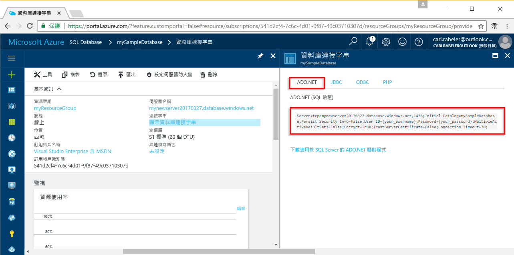

# <a name="use-net-core-c-to-query-an-azure-sql-database"></a>使用 .NET Core (C#) 查詢 Azure SQL 資料庫

本快速入門教學課程示範如何在 Windows/Linux/macOS 上使用 [.NET Core](https://www.microsoft.com/net/) 來建立 C# 程式，以連線至 Azure SQL 資料庫，並使用 Transact-SQL 陳述式來查詢資料。

## <a name="prerequisites"></a>必要條件

若要完成本快速入門教學課程，請確定您具有下列項目︰

[!INCLUDE [prerequisites-create-db](../../includes/sql-database-connect-query-prerequisites-create-db-includes.md)]

- 在此快速入門教學課程中，您所使用電腦的公用 IP 位址[伺服器層級防火牆規則](sql-database-get-started-portal.md#create-a-server-level-firewall-rule)。

- 您已安裝[適用於您作業系統的 .NET Core](https://www.microsoft.com/net/core)。 

## <a name="sql-server-connection-information"></a>SQL Server 連線資訊

[!INCLUDE [prerequisites-server-connection-info](../../includes/sql-database-connect-query-prerequisites-server-connection-info-includes.md)]

#### <a name="for-adonet"></a>針對 ADO.NET

1. 按一下 [顯示資料庫連接字串] 以繼續。

2. 檢閱完整的 **ADO.NET** 連接字串。

    

> [!IMPORTANT]
> 在您執行本教學課程的電腦上，公用 IP 位址必須有防火牆規則。 如果您在不同電腦上或有不同的公用 IP 位址，請建立[使用 Azure 入口網站的伺服器層級防火牆規則](sql-database-get-started-portal.md#create-a-server-level-firewall-rule)。 
>
  
## <a name="create-a-new-net-project"></a>建立新的 .NET 專案

1. 開啟命令提示字元，並建立名為 sqltest 的資料夾。 瀏覽至您建立的資料夾中，然後執行下列命令：

    ```
    dotnet new console
    ```

2. 使用您慣用的文字編輯器開啟 sqltest.csproj並使用下列程式碼將 System.Data.SqlClient 新增為相依性：

    ```xml
    <ItemGroup>
        <PackageReference Include="System.Data.SqlClient" Version="4.4.0" />
    </ItemGroup>
    ```

## <a name="insert-code-to-query-sql-database"></a>插入程式碼以查詢 SQL 資料庫

1. 在您的開發環境或慣用的文字編輯器中開啟 Program.cs

2. 使用下列程式碼取代內容，並為您的伺服器、資料庫、使用者和密碼新增適當的值。

```csharp
using System;
using System.Data.SqlClient;
using System.Text;

namespace sqltest
{
    class Program
    {
        static void Main(string[] args)
        {
            try 
            { 
                SqlConnectionStringBuilder builder = new SqlConnectionStringBuilder();
                builder.DataSource = "your_server.database.windows.net"; 
                builder.UserID = "your_user";            
                builder.Password = "your_password";     
                builder.InitialCatalog = "your_database";

                using (SqlConnection connection = new SqlConnection(builder.ConnectionString))
                {
                    Console.WriteLine("\nQuery data example:");
                    Console.WriteLine("=========================================\n");
                    
                    connection.Open();       
                    StringBuilder sb = new StringBuilder();
                    sb.Append("SELECT TOP 20 pc.Name as CategoryName, p.name as ProductName ");
                    sb.Append("FROM [SalesLT].[ProductCategory] pc ");
                    sb.Append("JOIN [SalesLT].[Product] p ");
                    sb.Append("ON pc.productcategoryid = p.productcategoryid;");
                    String sql = sb.ToString();

                    using (SqlCommand command = new SqlCommand(sql, connection))
                    {
                        using (SqlDataReader reader = command.ExecuteReader())
                        {
                            while (reader.Read())
                            {
                                Console.WriteLine("{0} {1}", reader.GetString(0), reader.GetString(1));
                            }
                        }
                    }                    
                }
            }
            catch (SqlException e)
            {
                Console.WriteLine(e.ToString());
            }
            Console.ReadLine();
        }
    }
}
```

## <a name="run-the-code"></a>執行程式碼

1. 在命令提示字元中，執行下列命令：

   ```csharp
   dotnet restore
   dotnet run
   ```

2. 請確認前 20 個資料列已傳回，然後關閉應用程式視窗。


## <a name="next-steps"></a>後續步驟

- [使用命令列以開始使用在 Windows/Linux/macOS 上的 .NET Core](/dotnet/core/tutorials/using-with-xplat-cli)。
- 了解如何[使用 .NET 架構和 Visual Studio 來連線及查詢 Azure SQL 資料庫](sql-database-connect-query-dotnet-visual-studio.md)。  
- 深入了解如何[使用 SSMS 設計您的第一個 Azure SQL 資料庫](sql-database-design-first-database.md)或[使用 .NET 設計您的第一個 Azure SQL 資料庫](sql-database-design-first-database-csharp.md)。
- 如需 .NET 的詳細資訊，請參閱 [.NET 文件](https://docs.microsoft.com/dotnet/)。
