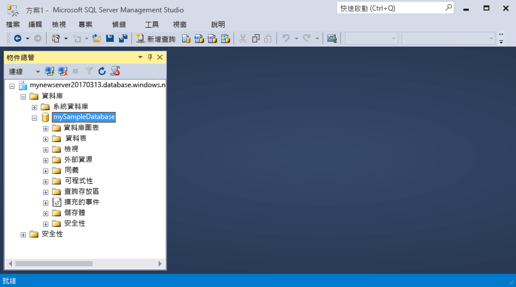

# <a name="migrate-your-sql-server-database-to-azure-sql-database"></a>將 SQL Server Database 移轉至 Azure SQL Database

將 SQL Server 資料庫移到 Azure SQL Database 很簡單，只要在 Azure 中建立的空 SQL 資料庫，然後使用[資料移轉小幫手](https://www.microsoft.com/download/details.aspx?id=53595)(DMA) 將資料庫匯入 Azure。 您會在本教學課程中學到：

> [!div class="checklist"]
> * 在 Azure 入口網站中建立空的 Azure SQL 資料庫 (使用新的或現有的 Azure SQL Database 伺服器)
> * 在 Azure 入口網站中建立伺服器層級的防火牆規則 (如果之前未建立)
> * 使用[資料移轉小幫手](https://www.microsoft.com/download/details.aspx?id=53595) (DMA) 將 SQL Server 資料庫匯入空的 Azure SQL Database 
> * 使用 [SQL Server Management Studio](https://docs.microsoft.com/sql/ssms/download-sql-server-management-studio-ssms) (SSMS) 變更資料庫屬性

如果您沒有 Azure 訂用帳戶，請在開始之前先[建立免費帳戶](https://azure.microsoft.com/free/)。

## <a name="prerequisites"></a>必要條件

若要完成本教學課程，請確定已完成下列必要條件：

- 已安裝最新版的 [SQL Server Management Studio](https://docs.microsoft.com/sql/ssms/download-sql-server-management-studio-ssms) (SSMS)。  
- 已安裝最新版的[資料移轉小幫手](https://www.microsoft.com/download/details.aspx?id=53595) (DMA)。
- 您已識別並可存取要移轉的資料庫。 本教學課程使用 SQL Server 2008R2 或更新版本執行個體上的 [SQL Server 2008R2 AdventureWorks OLTP 資料庫](https://msftdbprodsamples.codeplex.com/releases/view/59211)，不過您亦可使用任何選擇的資料庫。 若要修正相容性問題，請使用 [SQL Server Data Tools](https://docs.microsoft.com/sql/ssdt/download-sql-server-data-tools-ssdt)。

## <a name="log-in-to-the-azure-portal"></a>登入 Azure 入口網站

登入 [Azure 入口網站](https://portal.azure.com/)。

## <a name="create-a-blank-sql-database"></a>建立空白 SQL Database

Azure SQL Database 會使用一組定義的[計算和儲存體資源](sql-database-service-tiers.md)建立。 此資料庫建立於 [Azure 資源群組](../azure-resource-manager/resource-group-overview.md)和 [Azure SQL Database 邏輯伺服器](sql-database-features.md)內。 

遵循以下步驟來建立空白 SQL 資料庫。 

1. 按一下 Azure 入口網站左上角的 [新增] 按鈕。

2. 從 [新增] 頁面中選取 [資料庫]，然後在 [新增] 頁面的 [SQL Database] 下選取 [建立]。

   

3. 使用下列資訊填寫 SQL Database 表單，如上圖所示︰   

   | 設定       | 建議的值 | 說明 | 
   | ------------ | ------------------ | ------------------------------------------------- | 
   | **資料庫名稱** | mySampleDatabase | 如需有效的資料庫名稱，請參閱[資料庫識別碼](https://docs.microsoft.com/sql/relational-databases/databases/database-identifiers)。 | 
   | **訂用帳戶** | 您的訂用帳戶  | 如需訂用帳戶的詳細資訊，請參閱[訂用帳戶](https://account.windowsazure.com/Subscriptions)。 |
   | **資源群組** | myResourceGroup | 如需有效的資源群組名稱，請參閱[命名規則和限制](https://docs.microsoft.com/azure/architecture/best-practices/naming-conventions)。 |
   | **選取來源** | 空白資料庫 | 指定應建立空白資料庫。 |

4. 按一下 [伺服器] 為您的新資料庫建立及設定新的伺服器。 在**新伺服器表單**表單中填寫下列資訊︰ 

   | 設定       | 建議的值 | 說明 | 
   | ------------ | ------------------ | ------------------------------------------------- | 
   | **伺服器名稱** | 任何全域唯一名稱 | 如需有效的伺服器名稱，請參閱[命名規則和限制](https://docs.microsoft.com/azure/architecture/best-practices/naming-conventions)。 | 
   | **伺服器管理員登入** | 任何有效名稱 | 如需有效的登入名稱，請參閱[資料庫識別碼](https://docs.microsoft.com/sql/relational-databases/databases/database-identifiers)。|
   | **密碼** | 任何有效密碼 | 您的密碼至少要有 8 個字元，而且必須包含下列幾種字元的其中三種︰大寫字元、小寫字元、數字和非英數字元。 |
   | **位置** | 任何有效位置 | 如需區域的相關資訊，請參閱 [Azure 區域](https://azure.microsoft.com/regions/)。 |

   

5. 按一下 [選取] 。

6. 按一下 [定價層] 可指定服務層、DTU 數目和儲存體數量。 瀏覽數據傳輸單元 (DTU) 數目的選項，以及可供您每個服務層使用的儲存體。 

7. 在此教學課程中，選取 [標準] 服務層，然後使用滑桿選取 **100 DTU (S3)** 和 **400** GB 的儲存體。

   

8. 若要使用 [附加元件儲存體] 選項，請接受預覽條款。 

   > [!IMPORTANT]
   > \* 大於內含儲存體數量的儲存體大小尚在預覽中，而且會產生額外成本。 如需詳細資訊，請參閱 [SQL Database 定價](https://azure.microsoft.com/pricing/details/sql-database/)。 
   >
   >\* 在進階層中，超過 1 TB 的儲存體目前在下列區域為可用狀態：美國東部 2、美國西部、美國維吉尼亞州政府、西歐、德國中部、東南亞、日本東部、澳大利亞東部、加拿大中部和加拿大東部。 請參閱 [P11-P15 目前限制](sql-database-resource-limits.md#single-database-limitations-of-p11-and-p15-when-the-maximum-size-greater-than-1-tb)。  
   > 

9. 在選取伺服器層、DTU 數目和儲存體數量之後，按一下 [套用]。  

10. 為空白資料庫選取**定序** (此教學課程中使用預設值)。 如需定序的詳細資訊，請參閱[定序](https://docs.microsoft.com/sql/t-sql/statements/collations)。

11. 您現在已完成 SQL Database 表單，請按一下 [建立] 來佈建資料庫。 佈建需要幾分鐘的時間。 

12. 在工具列上，按一下 [通知] 以監視部署程序。
    
     

## <a name="create-a-server-level-firewall-rule"></a>建立伺服器層級防火牆規則

SQL Database 服務會在伺服器層級建立防火牆，防止外部應用程式和工具連線到伺服器或伺服器上的任何資料庫，除非建立防火牆規則以針對特定的 IP 位址開啟防火牆。 請遵循下列步驟來為您用戶端的 IP 位址建立 [SQL Database 伺服器層級防火牆規則](sql-database-firewall-configure.md)，並讓外部連線僅能夠穿過您 IP 位址的 SQL Database 防火牆。 

> [!NOTE]
> SQL Database 會透過連接埠 1433 通訊。 如果您嘗試從公司網路進行連線，您網路的防火牆可能不允許透過連接埠 1433 的輸出流量。 若情況如此，除非 IT 部門開啟連接埠 1433，否則您無法連線至 Azure SQL Database 伺服器。
>

1. 部署完成之後，按一下左側功能表中的 [SQL Database]，然後按一下 [SQL Database] 頁面上的 [mySampleDatabase]。 資料庫的概觀頁面隨即開啟，其中會顯示完整伺服器名稱 (例如 **mynewserver-20170824.database.windows.net**)，並提供進一步的組態選項。 

2. 在後續的快速入門中，請複製此完整伺服器名稱，才能用來連線到伺服器及其資料庫。 

    

3. 在工具列上按一下 [設定伺服器防火牆]。 SQL Database 伺服器的 [防火牆設定] 頁面隨即開啟。 

    

4. 按一下工具列上的 [新增用戶端 IP]，將目前的 IP 位址新增至新的防火牆規則。 防火牆規則可以針對單一 IP 位址或 IP 位址範圍開啟連接埠 1433。

5. 按一下 [儲存] 。 系統便會為目前的 IP 位址建立伺服器層級防火牆規則，以便在邏輯伺服器上開啟連接埠 1433。

6. 依序按一下 [確定]，然後關閉 [防火牆設定] 頁面。

您現在可以利用 SQL Server Management Studio、資料移轉小幫手 或您選擇的其他工具，使用在先前程序中建立的伺服器管理帳戶從這個 IP 位址連線至 SQL Database 伺服器及其資料庫。

> [!IMPORTANT]
> 根據預設，已對所有 Azure 服務啟用透過 SQL Database 防火牆存取。 按一下此頁面上的 [關閉] 即可對所有 Azure 服務停用。

## <a name="sql-server-connection-information"></a>SQL Server 連線資訊

在 Azure 入口網站中取得 Azure SQL Database 伺服器的完整伺服器名稱。 透過用戶端工具，包括資料移轉小幫手和 SQL Server Management Studio，您可使用此完整伺服器名稱連線到您的 Azure SQL Server。

1. 登入 [Azure 入口網站](https://portal.azure.com/)。
2. 從左側功能表中選取 [SQL Database]，按一下 [SQL Database]頁面上您的資料庫。 
3. 在 Azure 入口網站中您資料庫的 [基本資訊] 窗格中，找到後複製 [伺服器名稱]。

   

## <a name="migrate-your-database"></a>移轉資料庫

遵循以下步驟，使用**[資料移轉小幫手](https://www.microsoft.com/download/details.aspx?id=53595)**評估資料庫對於移轉至 Azure SQL Database 的整備程度，並完成移轉。

1. 開啟 **Data Migration Assistant**。 您可在任何電腦上執行 DMA，只要它能連線至網際網路並連線至內含您規劃要移轉之資料庫的 SQL Server 執行個體。 無須在裝載要移轉之 SQL Server 執行個體的電腦上安裝 DMA。 您在上一個程序中建立的防火牆規則，必須適用於您執行資料移轉小幫手的電腦。

     

2. 在左側功能表中，按一下 [新增]以建立 [評估] 專案。 填入必要的值，然後按一下 [建立]：

   | 設定      | 建議的值 | 說明 | 
   | ------------ | ------------------ | ------------------------------------------------- | 
   | 專案類型 | 移轉 | 選擇要評估您的資料庫移轉，或選擇在相同的工作流程中評估並移轉 |
   |專案名稱|移轉教學課程| 描述性名稱 |
   |來源伺服器類型| SQL Server | 這是目前唯一支援的來源 |
   |目標伺服器類型| Azure SQL Database| 選項包括：Azure SQL Database、SQL Server、Azure 虛擬機器上的 SQL Server |
   |移轉範圍| 結構描述和資料| 選項包括：結構描述和資料、僅限結構描述、僅限資料 |
   
   

3.  在 [選取來源] 頁面中填入必要的值，然後按一下 [連線]：

    | 設定      | 建議的值 | 說明 | 
    | ------------ | ------------------ | ------------------------------------------------- | 
    | 伺服器名稱 | 您的伺服器名稱或 IP 位址 | 您的伺服器名稱或 IP 位址 |
    | 驗證類型 | 您慣用的驗證類型| 選項：Windows 驗證、SQL Server 驗證、Active Directory 整合式驗證、Active Directory 密碼驗證 |
    | 使用者名稱 | 您的登入名稱 | 您的登入必須具有 **CONTROL SERVER** 權限 |
    | 密碼| 您的密碼 | 您的密碼 |
    | 連線屬性| 選取適合環境的 [加密連線] 和 [信任伺服器憑證]。 | 選擇適合連線至您的伺服器的屬性 |

    

5. 選取來源伺服器中的單一資料庫，以移轉至 Azure SQL Database，然後按一下 [下一步]。 本教學課程中，只有單一資料庫。

6. 在 [選取目標] 頁面中填入必要的值，然後按一下 [連線]：

    | 設定      | 建議的值 | 說明 | 
    | ------------ | ------------------ | ------------------------------------------------- | 
    | 伺服器名稱 | 您的完整 Azure Database 伺服器名稱 | 先前程序中的完整 Azure Database 伺服器名稱 |
    | 驗證類型 | SQL Server 驗證 | 本教學課程編寫時，SQL Server 驗證是唯一的選項，但 Azure SQL Database 也支援 Active Directory 整合式驗證與 Active Directory 密碼驗證 |
    | 使用者名稱 | 您的登入名稱 | 您的登入必須具有來源資料庫的 **CONTROL DATABASE** 權限 |
    | 密碼| 您的密碼 | 您的密碼 |
    | 連線屬性| 選取適合環境的 [加密連線] 和 [信任伺服器憑證]。 | 選擇適合連線至您的伺服器的屬性 |

    

7. 選取從您在上一個程序建立之目標伺服器中的資料庫，然後按一下 [下一步] 啟動來源資料庫結構描述的評估程序。 本教學課程中，只有單一資料庫。 請注意，此資料庫的相容性等級設定為 140，這是 Azure SQL Database 中所有新資料庫的預設相容性等級。

   > [!IMPORTANT] 
   > 您將資料庫移轉至 Azure SQL Database 後，可選擇以特定相容性等級運作資料庫於以便回溯相容。 如需於特定相容性層級操作資料庫的含意與選項詳細資訊，請參閱 [ALTER DATABASE 相容性層級 (ALTER DATABASE Compatibility Level)](https://docs.microsoft.com/sql/t-sql/statements/alter-database-transact-sql-compatibility-level)。 如需相容性層級其他相關資料庫等級設定的資訊，另請參閱 [ALTER DATABASE 範圍組態 (ALTER DATABASE SCOPED CONFIGURATION)](https://docs.microsoft.com/sql/t-sql/statements/alter-database-scoped-configuration-transact-sql)。
   >

8. 來源資料庫結構描述評估程序完成後，在 [選取物件] 頁面上檢閱針對移轉選取的物件，並檢閱包含問題的物件。 例如，檢閱 **SERVERPROPERTY('LCID')** 行為變更的 **dbo.uspSearchCandidateResumes** 物件，以及全文檢索搜尋變更的 **HumanResourcesJobCandidate** 物件。 

   > [!IMPORTANT] 
   > 根據資料庫的設計和應用程式的設計，當您移轉來源資料庫，可能需要在移轉之後修改其中一個或兩個資料庫或應用程式 (甚至某些情況下，要在移轉前修改)。 如需可能影響移轉的 Transact-SQL 差異詳細資訊，請參閱[解決移轉至 SQL Database 期間的 Transact-SQL 差異](sql-database-transact-sql-information.md)。

     

9. 按一下 [產生 SQL 指令碼] 以產生來源資料庫中結構描述物件的指令碼。 
10. 檢閱產生的指令碼，然後視需要按一下 [下一個問題]，檢閱找到的評估問題和建議。 例如，針對全文檢索搜尋，升級時的建議是利用全文檢索功能測試應用程式。 您可以儲存或複製指令碼 (如果您想這麼做)。

     

11. 按一下[部署結構描述]，觀看結構描述移轉程序。

     

12. 結構描述移轉完成時，檢閱結果尋找是否有錯誤，假設沒有錯誤，按一下 [移轉資料]。
13. 在 [選取資料表] 頁面上，檢閱針對移轉所選取的資料表，然後按一下 [開始資料移轉]。

     

14. 觀看移轉程序。

     

## <a name="connect-to-the-database-with-ssms"></a>使用 SSMS 連接到資料庫

使用 [SQL Server Management Studio](https://docs.microsoft.com/sql/ssms/sql-server-management-studio-ssms) 建立對 Azure SQL Database 伺服器的連線。

1. 開啟 SQL Server Management Studio。

2. 在 [連接到伺服器] 對話方塊中，輸入下列資訊：

   | 設定       | 建議的值 | 說明 | 
   | ------------ | ------------------ | ------------------------------------------------- | 
   | 伺服器類型 | 資料庫引擎 | 這是必要值 |
   | 伺服器名稱 | 完整伺服器名稱 | 名稱應該類似這樣︰**mynewserver20170824.database.windows.net**。 |
   | 驗證 | SQL Server 驗證 | 在本教學課程中，我們只設定了 SQL 驗證這個驗證類型。 |
   | 登入 | 伺服器管理帳戶 | 這是您在建立伺服器時所指定的帳戶。 |
   | 密碼 | 伺服器管理帳戶的密碼 | 這是您在建立伺服器時所指定的密碼。 |

   

3. 按一下 [連接到伺服器] 對話方塊中的 [選項]。 在 [連線到資料庫] 區段中，輸入 **mySampleDatabase** 以連線到這個資料庫。

     

4. 按一下 [ **連接**]。 [物件總管] 視窗隨即在 SSMS 中開啟。 

5. 在 [物件總管] 中，展開 [資料庫]，然後展開 [mySampleDatabase] 以檢視範例資料庫中的物件。

     

## <a name="change-database-properties"></a>變更資料庫屬性

您可使用 SQL Server Management Studio 變更服務層、效能等級和相容性層級。 在匯入階段，建議您匯入至更高的效能層級資料庫以獲得最佳效能，但您可以在匯入完成之後相應減少該資料庫以節省成本，直到您準備好主動使用匯入的資料庫為止。 變更相容性層級可能會產生較佳的效能，並存取 Azure SQL Database 服務的最新功能。 當您移轉較舊的資料庫時，會在與所匯入資料庫相容的最低支援層級維護其資料庫相容性層級。 如需詳細資訊，請參閱[改善 Azure SQL Database 中相容性層級 130 的查詢效能](sql-database-compatibility-level-query-performance-130.md).

1. 在 [物件總管] 中，於 **mySampleDatabase** 上按一下滑鼠右鍵，然後按一下 [新增查詢]。 此時會開啟已連線到您資料庫的查詢視窗。

2. 執行下列命令，將服務層設定為 [標準]，並將效能等級設定為 [S1]。

    ```sql
    ALTER DATABASE mySampleDatabase 
    MODIFY 
        (
        EDITION = 'Standard'
        , MAXSIZE = 250 GB
        , SERVICE_OBJECTIVE = 'S1'
    );
    ```

## <a name="next-steps"></a>後續步驟 
在本教學課程中，您已了解：

> * 在 Azure 入口網站中建立空的 Azure SQL Database 
> * 在 Azure 入口網站中建立伺服器層級的防火牆規則 
> * 使用[資料移轉小幫手](https://www.microsoft.com/download/details.aspx?id=53595) (DMA) 將 SQL Server 資料庫匯入空的 Azure SQL Database 
> * 使用 [SQL Server Management Studio](https://docs.microsoft.com/sql/ssms/download-sql-server-management-studio-ssms) (SSMS) 變更資料庫屬性

前進至下一個教學課程，以了解如何保護資料庫。

> [!div class="nextstepaction"]
> [保護 Azure SQL Database](sql-database-security-tutorial.md)。


