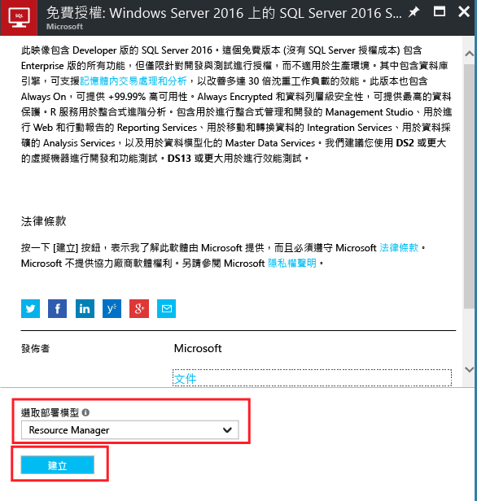

# 在 Azure 入口網站中佈建 Windows SQL Server 虛擬機器

> [!div class="op_single_selector"]
> * [入口網站](virtual-machines-windows-portal-sql-server-provision.md)
> * [PowerShell](virtual-machines-windows-ps-sql-create.md)
> * [Linux](../../linux/sql/provision-sql-server-linux-virtual-machine.md)

在本快速入門教學課程中，您可以使用 Azure 入口網站來建立已安裝 SQL Server 的 Linux 虛擬機器。

在本教學課程中，您將：

* [從資源庫中選取 SQL VM 映像](#select)
* [設定並建立 VM](#configure)
* [透過遠端桌面開啟 VM](#remotedesktop)
* [從遠端連接到 SQL Server](#connect)

## 從資源庫中選取 SQL VM 映像

1. 使用您的帳戶登入 [Azure 入口網站](https://portal.azure.com) 。

   > [!NOTE]
   > 如果您沒有 Azure 帳戶，請造訪 [Azure 免費試用](https://azure.microsoft.com/pricing/free-trial/)。

1. 在 Azure 入口網站上，按一下 [新增] 。 入口網站會開啟 [新增] 視窗。

1. 在 新增 視窗中，按一下 計算，然後按一下檢視全部。

   

1. 在搜尋方塊中輸入 **SQL Server 2017**，然後按 ENTER。

1. 然後按一下 [篩選] 圖示。

1. 在 [篩選] 視窗中，針對發行者勾選 [以 Windows 作為基礎] 子類別目錄和 [Microsoft]。 然後按一下 [完成]，將結果篩選為 Microsoft 發行的 Windows SQL Server 映像。

   

1. 檢閱可用的 SQL Server 映像。 每個映像皆識別一個 SQL Server 版本和一個作業系統。

1. 選取名為 [免費 SQL Server 授權︰Windows Server 2016 上的 SQL Server 2017 Developer] 的映像。

   > [!TIP]
   > 本教學課程中使用 Developer 版本，因為它是免費供開發測試使用的 SQL Server 完整功能版。 您只需支付執行 VM 的費用。 不過，您可以自由選擇本教學課程中所要使用的映像。

   > [!TIP]
   > SQL VM 映像在您所建立 VM 的每分鐘定價中包含 SQL Server 的授權成本 (Developer 和 Express 版本除外)。 SQL Server Developer 免費供開發/測試 (非生產環境) 使用，SQL Express 免費供輕量型工作負載 (少於 1GB 記憶體、小於 10 GB 儲存體) 使用。 另一個選項是自備授權 (BYOL)，並只針對 VM 付費。 這些映像的名稱前面會有 {BYOL}。 
   >
   > 如需這些選項的詳細資訊，請參閱 [SQL Server Azure VM 的定價指導方針](virtual-machines-windows-sql-server-pricing-guidance.md)。

1. 在 [選取部署模型] 底下，確認已選取 [Resource Manager]。 Resource Manager 是新的虛擬機器建議採用的部署模型。 

1. 按一下 [建立] 。

    

## 設定 VM
有五個視窗可用來設定 SQL Server 虛擬機器。

| 步驟 | 說明 |
| --- | --- |
| **基本概念** |[設定基本設定](#1-configure-basic-settings) |
| **大小** |[選擇虛擬機器大小](#2-choose-virtual-machine-size) |
| **設定** |[設定選用功能](#3-configure-optional-features) |
| **SQL Server 設定** |[進行 SQL Server 設定](#4-configure-sql-server-settings) |
| **摘要** |[檢閱摘要](#5-review-the-summary) |

## 1.設定基本設定

在 [基本概念]  視窗中提供下列資訊：

* 輸入唯一的虛擬機器 [名稱] 。

* 選取 **SSD** 作為 VM 磁碟類型，以獲得最佳效能。

* 指定 VM 上本機系統管理員帳戶的 [使用者名稱]。 這個帳戶也會加入至 SQL Server **sysadmin** 固定伺服器角色。

* 提供強式 [密碼] 。

* 如果您有多個訂用帳戶，請確認訂用帳戶適用於新的 VM。

* 在 [資源群組]  方塊中，輸入新資源群組的名稱。 或者，若要使用現有的資源群組，請按一下 [使用現有項目]。 資源群組是 Azure (虛擬機器、儲存體帳戶、虛擬網路等) 中相關資源的集合。

  > [!NOTE]
  > 如果您只是測試或了解 Azure 中的 SQL Server 部署，使用新的資源群組很有幫助。 完成測試之後，請刪除資源群組以自動刪除此 VM 以及與該資源群組相關聯的所有資源。 如需有關資源群組的詳細資訊，請參閱 [Azure Resource Manager 概觀](../../../azure-resource-manager/resource-group-overview.md)。

* 選取將要裝載此部署之 Azure 區域的 [位置]。

* 按一下 [確定]  來儲存設定。

    

## 2.選擇虛擬機器大小

在 [大小] 步驟上，請在 [選擇大小] 視窗中選擇虛擬機器大小。 此視窗一開始會顯示以您選取的映像為基礎的建議機器大小。

> [!IMPORTANT]
> [選擇大小] 視窗上顯示的估計每月成本不包含 SQL Server 授權成本。 這是 VM 單獨的成本。 若為 SQL Server 的 Express 和 Developer 版本，這是預估的總成本。 若為其他版本，請參閱 [Windows 虛擬機器價格頁面](https://azure.microsoft.com/pricing/details/virtual-machines/windows/)，然後選取您的目標 SQL Server 版本。 另請參閱 [SQL Server Azure VM 的定價指導方針](virtual-machines-windows-sql-server-pricing-guidance.md)。

對於生產工作負載，請參閱 [Azure 虛擬機器中的 SQL Server 效能最佳做法](virtual-machines-windows-sql-performance.md)中建議的機器大小和組態。 如果您需要未列出的機器大小，請按一下 [全部檢視] 按鈕。

> [!NOTE]
> 如需關於虛擬機器大小的詳細資訊，請參閱 [虛擬機器大小](../sizes.md?toc=%2fazure%2fvirtual-machines%2fwindows%2ftoc.json)。

選擇您的機器大小，然後按一下選取 。

## 3.設定選用功能

在 [設定]  視窗上，設定虛擬機器的 Azure 儲存體、網路功能及監視功能。

* 在 [儲存體] 之下，選取 [是] 以使用 [受控磁碟]。

   > [!NOTE]
   > Microsoft 建議使用 SQL Server 適用的受控磁碟。 受控磁碟會在背景中處理儲存體。 此外，當具有受控磁碟的虛擬機器在相同的可用性設定組時，Azure 會分散儲存資源以提供適當的備援。 如需其他資訊，請參閱 [Azure 受控磁碟概觀 (英文)](../../../storage/storage-managed-disks-overview.md)。 如需可用性設定組中受控磁碟的具體資訊，請參閱[在可用性設定組中使用 VM 的受控磁碟](../manage-availability.md)。

* 在 [網路] 底下，您可以接受自動填入的值。 也可以按一下每個功能，手動設定 [虛擬網路]、[子網路]、[公用 IP 位址] 及 [網路安全性群組]。 基於本教學課程的用途，您可以保留預設值。

* Azure 預設會使用為 VM 指定的相同儲存體帳戶來啟用 [監視]  。 您可以在這裡變更這些設定。

* 在 [可用性設定組] 之下，您可以為本教學課程保留預設值 [無]。 如果您打算設定「SQL AlwaysOn 可用性群組」，請設定可用性以避免重新建立虛擬機器。  如需詳細資訊，請參閱 [管理虛擬機器的可用性](../manage-availability.md?toc=%2fazure%2fvirtual-machines%2fwindows%2ftoc.json)。

完成這些設定時，請按一下 [確定] 。

## 4.進行 SQL Server 設定
在 [SQL Server 設定]  視窗上，設定 SQL Server 的特定設定和最佳化。 您可以設定的 SQL Server 設定包括：

| 設定 |
| --- |
| [連線能力](#connectivity) |
| [驗證](#authentication) |
| [儲存體組態](#storage-configuration) |
| [自動修補](#automated-patching) |
| [自動備份](#automated-backup) |
| [Azure 金鑰保存庫整合](#azure-key-vault-integration) |
| [SQL Server Machine Learning 服務](#sql-server-machine-learning-services) |

### 連線能力

在 [SQL 連線] 底下，指定您要對此 VM 上的 SQL Server 執行個體進行的存取類型。 基於本教學課程的目的，指定 [公用 (網際網路)]  以允許從網際網路上的電腦或服務連線到 SQL Server。 在已選取此選項的情況下，Azure 會自動設定防火牆和網路安全性群組以允許連接埠 1433 上的流量。

> [!TIP]
> 根據預設，SQL Server 會在已知通訊埠 **1433** 上接聽。 為了提高安全性，變更前一個對話方塊中的連接埠，以在非預設連接埠 (例如 1401) 上接聽。 如果您這麼做，您必須使用該連接埠從任何用戶端工具 (例如 SSMS) 進行連線。

若要透過網際網路連接到 SQL Server，您也必須啟用下一節所述的「SQL Server 驗證」。

如果您偏好不要啟用透過網際網路連線到 Database Engine 的功能，請選擇下列其中一個選項：

*  只允許從 VM 內連接到 SQL Server。
*  允許從相同虛擬網路中的電腦或服務連接到 SQL Server。

一般情況下，選擇您的案例允許的最嚴格連線能力，即可改善安全性。 但所有透過網路安全性群組規則和 SQL/Windows 驗證的選項都是安全的。 建立 VM 後，您可以編輯網路安全性群組。 如需詳細資訊，請參閱 [Azure 虛擬機器中的 SQL Server 安全性考量](virtual-machines-windows-sql-security.md)。

> [!NOTE]
> SQL Server Express 版本的虛擬機器映像不會自動啟用 TCP/IP 通訊協定。 這也適用於公用和私用連線能力選項。 在 Express 版本中，您必須在建立 VM 之後，使用「SQL Server 組態管理員」來 [手動啟用 TCP/IP 通訊協定](#configure-sql-server-to-listen-on-the-tcp-protocol) 。

### 驗證

如果您需要「SQL Server 驗證」，請按一下 [SQL 驗證]  under 。

> [!NOTE]
> 如果您打算透過網際網路存取 SQL Server (也就是 [公用] 連線選項)，您必須在這裡啟用 SQL 驗證。 對 SQL Server 進行公用存取需要使用「SQL 驗證」。
> 
> 

如果您啟用 [SQL Server 驗證]，請指定 [登入名稱] 和 [密碼]。 這個使用者名稱會設定為 SQL Server 驗證登入以及 **sysadmin** 固定伺服器角色的成員。 如需有關「驗證模式」的詳細資訊，請參閱 [選擇驗證模式](https://docs.microsoft.com/sql/relational-databases/security/choose-an-authentication-mode) 。

如果您未啟用 SQL Server 驗證，您可以在 VM 上使用本機系統管理員帳戶連接到 SQL Server 執行個體。

### 儲存體組態

按一下 [儲存體組態]  以指定儲存體需求。

> [!NOTE]
> 如果將以手動方式將 VM 設定為使用標準儲存體，則無法使用此選項。 自動儲存體最佳化只適用於進階儲存體。

> [!TIP]
> 每個滑桿的停駐點數目和上限取決於您選取的 VM 大小。 較大型且更強大的 VM 能夠進一步相應增加。

您可以用每秒輸入/輸出作業數 (IOPs)、輸送量 (單位為 MB/s) 及總儲存體大小來指定需求。 請使用滑動標尺來設定這些值。 您可以根據工作負載變更這些儲存體設定。 入口網站會自動根據這些需求計算要連結和設定的磁碟數目。

在 [儲存體最佳化] 底下，選取下列其中一個選項：

*  是預設設定，支援大多數工作負載。
*  可將儲存體最佳化來處理傳統資料庫 OLTP 工作負載。
*  可將儲存體最佳化來處理分析和報告工作負載。

### 自動修補

**Automated patching** 。 自動修補可讓 Azure 自動修補 SQL Server 和作業系統。 請為維護期間指定一週當中的某一天、時間及持續時間。 Azure 會在此維護期間執行修補。 維護期間排程會使用 VM 地區設定做為時間。 如果您不想要讓 Azure 自動修補 SQL Server 和作業系統，請按一下 [停用] 。  

如需詳細資訊，請參閱 [Azure 虛擬機器中的 SQL Server 自動修補](virtual-machines-windows-sql-automated-patching.md)。

### 自動備份

在 [自動備份] 底下，可以為所有資料庫啟用自動資料庫備份。 預設會停用自動備份。

當您啟用 SQL 自動備份時，您可以設定下列各項：

* 備份的保留期限 (天數)
* 要用於備份的儲存體帳戶
* 備份的加密選項和密碼
* 備份系統資料庫
* 設定備份排程

若要加密備份，請按一下 [啟用] 。 然後指定 [密碼] 。 Azure 會建立憑證來加密備份，並使用指定的密碼來保護該憑證。

 如需詳細資訊，請參閱 [Azure 虛擬機器中 SQL Server 的自動化備份](virtual-machines-windows-sql-automated-backup.md)。

### Azure 金鑰保存庫整合

若要在 Azure 中儲存用於加密的安全性密碼，請按一下 [Azure 金鑰保存庫整合]，然後按一下 [啟用]。

下表列出設定「Azure 金鑰保存庫整合」時所需的參數。

| 參數 | 說明 | 範例 |
| --- | --- | --- |
| **金鑰保存庫 URL** |金鑰保存庫的位置。 |https://contosokeyvault.vault.azure.net/ |
| **主體名稱** |Azure Active Directory 服務主體名稱。 此名稱也稱為「用戶端識別碼」。 |fde2b411-33d5-4e11-af04eb07b669ccf2 |
| **主體密碼** |Azure Active Directory 服務主體密碼。 此密碼也稱為「用戶端密碼」。 |9VTJSQwzlFepD8XODnzy8n2V01Jd8dAjwm/azF1XDKM= |
| **認證名稱** |**認證名稱**：AKV 整合會在 SQL Server 內建立認證，允許 VM 具有金鑰保存庫的存取權。 選擇此認證的名稱。 |mycred1 |

如需詳細資訊，請參閱 [在 Azure VM 上設定 SQL Server 的 Azure 金鑰保存庫整合](virtual-machines-windows-ps-sql-keyvault.md)。

### SQL Server Machine Learning 服務

您可以選擇啟用 [SQL Server Machine Learning 服務](https://msdn.microsoft.com/library/mt604845.aspx)。 這可讓您搭配使用進階分析與 SQL Server 2017。 按一下 [SQL Server 設定] 視窗上的 [啟用]。

完成 SQL Server 設定之後，請按一下 [確定] 。

## 5.檢閱摘要

在 [摘要] 視窗上檢閱摘要，然後按一下 [購買] 來建立為此 VM 指定的 SQL Server、資源群組及資源。

您可以從 Azure 入口網站監視部署。 畫面頂端的 [通知]  按鈕會顯示基本的部署狀態。

> [!NOTE]
> 為了讓您了解部署時間，我已使用預設設定將 SQL VM 部署到美國東部區域。 此測試部署大約花費 12 分鐘才完成。 但是根據您的區域和選取的設定，您可能會經歷較快或較慢的部署時間。

## 透過遠端桌面開啟 VM

使用下列步驟，透過遠端桌面連線到 SQL Server 虛擬機器︰

> [!INCLUDE [Connect to SQL Server VM with remote desktop](../../../../includes/virtual-machines-sql-server-remote-desktop-connect.md)]

連線到 SQL Server 虛擬機器之後，您可以啟動 SQL Server Management Studio，然後使用您的本機系統管理員認證透過「Windows 驗證」進行連線。 如果您已啟用 SQL Server 驗證，您也可以使用您在佈建期間所設定的 SQL 登入和密碼以 SQL 驗證連線。

存取電腦可讓您根據您的需求直接變更電腦和 SQL Server 設定。 例如，您可以設定防火牆設定或變更 SQL Server 組態設定。

## 針對 Developer 和 Express 版本啟用 TCP/IP

佈建新的 SQL Server VM 時，Azure 不會對 SQL Server Developer 和 Express 版本自動啟用 TCP/IP 通訊協定。 以下步驟說明如何以手動方式啟用 TCP/IP，以便您經由 IP 位址從遠端連線。

下列步驟使用 [SQL Server 組態管理員] 來對 SQL Server Developer 和 Express 版本啟用 TCP/IP 通訊協定。

> [!INCLUDE [Connect to SQL Server VM with remote desktop](../../../../includes/virtual-machines-sql-server-connection-tcp-protocol.md)]

## 遠端連線到 SQL Server

本教學課程中，我們選取了虛擬機器的 [公用] 存取權和 [SQL Server 驗證]。 這些設定會自動設定虛擬機器，以允許透過網際網路來自任何用戶端的 SQL Server 連線 (假設它們有正確的 SQL 登入)。

> [!NOTE]
> 如果您未在佈建期間選取 [公用]，您可以在佈建之後，透過入口網站變更 SQL 連線設定。 如需詳細資訊，請參閱[變更 SQL 連線設定](virtual-machines-windows-sql-connect.md#change)。

下列各節說明如何透過網際網路，從不同的電腦連接到您的 VM 上的 SQL Server 執行個體。

> [!INCLUDE [Connect to SQL Server in a VM Resource Manager](../../../../includes/virtual-machines-sql-server-connection-steps-resource-manager.md)]

## 後續步驟

如需在 Azure 中使用 SQL Server 的其他資訊，請參閱 [Azure 虛擬機器上的 SQL Server](virtual-machines-windows-sql-server-iaas-overview.md) 和[常見問題集](virtual-machines-windows-sql-server-iaas-faq.md)。